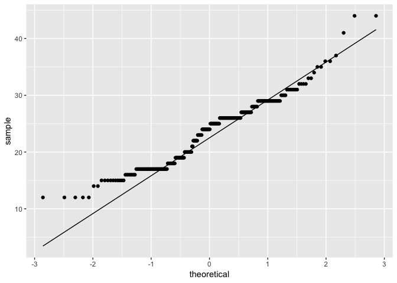

Lecture 05 Example Code
================
Christopher Prener, Ph.D.
(September 24, 2018)

## Introduction

This notebook illustrates functions for testing normality.

## Dependencies

This notebook requires the `ggplot2` package as well as the `janitor`
and `skimr` packages.

``` r
# tidyverse packages
library(ggplot2) # for qqplots

# other packages
library(moments)   # normality testing - skew and kurtosis
library(nortest)   # normality testing - shapiro-francia test
```

We’ll also use `stats` but it is already loaded\!

## Load Data

This notebook requires data from the `ggplot2` package:

``` r
auto <- mpg
```

## Illustrate Descriptive Statistics for Normality

First, we’ll use `moments` to calculate skew:

``` r
skewness(auto$hwy)
```

    ## [1] 0.366865

We get a slightly positive value for skew that indicates a longer right
tail, but the test statistic itself is well within the range of
acceptable values.

Next, we’ll use `moments` to calculate kurtosis:

``` r
kurtosis(auto$hwy)
```

    ## [1] 3.163929

We get a value just above 3, which is an indication of a relatively
mesokurtic distribution. Again, this is well within the range of
acceptable values.

## Illustrate a Q-Q Plot

We can use `ggplot2` to create a q-q plot of our distribution:

``` r
ggplot(data = auto, mapping = aes(sample = hwy)) +
  stat_qq() +
  stat_qq_line()
```

<!-- -->

We get a distribution that roughtly parallels the 45 degree line, with
some deviations in particular on the left side of the distribution.

## Shapiro-Francia Test

Finally, we can use `nortest` to calculate the Shapiro-Francia test
statistic:

``` r
sf.test(auto$hwy)
```

    ## 
    ##  Shapiro-Francia normality test
    ## 
    ## data:  auto$hwy
    ## W = 0.95929, p-value = 1.16e-05

The results of the Shapiro-Francia test (W = 0.959, p \< 0.001) suggest
that the distribution does not meet the strict assumption of normality
for this test.
